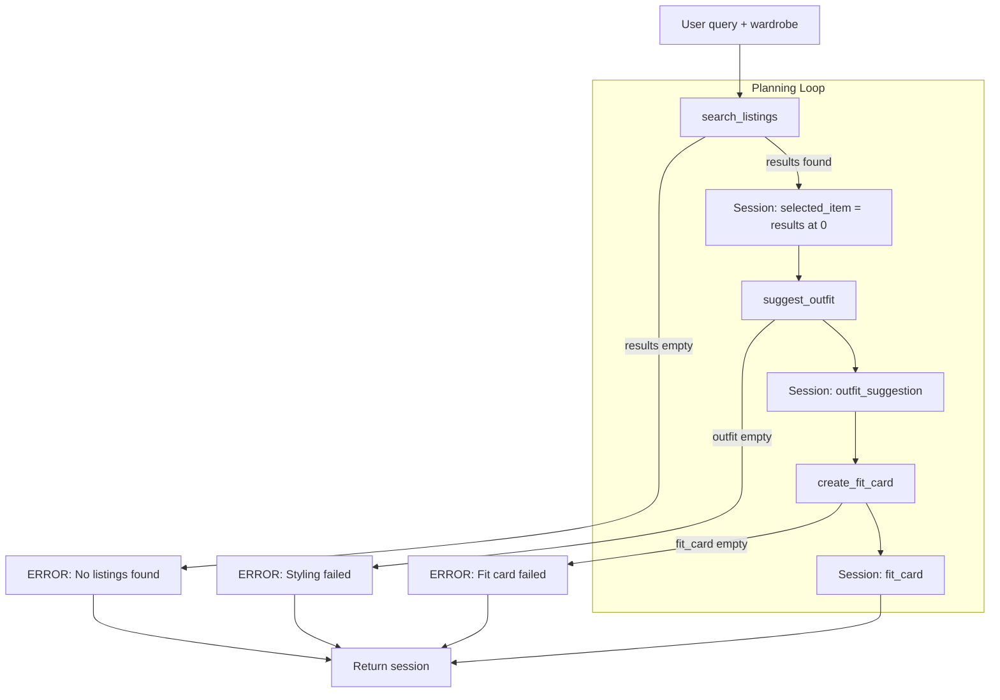

# FitFindr — planning.md

> Complete this document before writing any implementation code.
> Your spec and agent diagram are what you'll use to direct AI tools (Claude, Copilot, etc.) to generate your implementation — the more specific they are, the more useful the generated code will be.
> Your planning.md will be reviewed as part of your submission.
> Update it before starting any stretch features.

---

## Tools

List every tool your agent will use. For each tool, fill in all four fields.
You must have at least 3 tools. The three required tools are listed — add any additional tools below them.

### Tool 1: search_listings

**What it does:**
Searches the mock listings dataset for secondhand items that match the user's description. Applies optional size and price filters, scores results by keyword relevance, and returns the best matches first.

**Input parameters:**
- `description` (str): Keywords describing what the user wants (e.g. `"vintage graphic tee"`). Matched against each listing's `title`, `description`, and `style_tags`.
- `size` (str | None): Size to filter by (e.g. `"M"`). Case-insensitive partial match (e.g. `"M"` matches `"S/M"`). Pass `None` to skip size filtering.
- `max_price` (float | None): Maximum price in dollars, inclusive (e.g. `30.0`). Pass `None` to skip price filtering.

**What it returns:**
A list of listing dicts sorted by relevance (best match first). Each dict has:
- `id` (str): unique listing ID (e.g. `"lst_033"`)
- `title` (str): item name
- `description` (str): seller description
- `category` (str): one of `tops`, `bottoms`, `outerwear`, `shoes`, `accessories`
- `style_tags` (list[str]): style descriptors (e.g. `["vintage", "grunge", "band tee"]`)
- `size` (str): size label as listed (e.g. `"M"`, `"S/M"`, `"W30 L30"`)
- `condition` (str): one of `excellent`, `good`, `fair`
- `price` (float): price in dollars
- `colors` (list[str]): color names
- `brand` (str | None): brand name, or `null` if unknown
- `platform` (str): one of `depop`, `thredUp`, `poshmark`

Returns an empty list `[]` if nothing matches. Does not raise an exception.

**What happens if it fails or returns nothing:**
The agent sets `session["error"]` to a helpful message (e.g. suggest broadening the search, raising the price cap, or trying a different size) and returns early. It does not call `suggest_outfit` or `create_fit_card`.

---

### Tool 2: suggest_outfit

**What it does:**
Takes a listing the user might buy and their existing wardrobe, then uses the LLM to suggest 1–2 complete outfits. Names specific wardrobe pieces when available; falls back to general styling advice when the wardrobe is empty.

**Input parameters:**
- `new_item` (dict): A single listing dict from `search_listings` (same fields as above). The item the user is considering buying.
- `wardrobe` (dict): The user's closet, loaded via `get_example_wardrobe()` or `get_empty_wardrobe()`. Shape:
  - `items` (list[dict]): each wardrobe item has:
    - `id` (str): unique ID (e.g. `"w_001"`)
    - `name` (str): short description (e.g. `"Baggy straight-leg jeans, dark wash"`)
    - `category` (str): one of `tops`, `bottoms`, `outerwear`, `shoes`, `accessories`
    - `colors` (list[str]): color names
    - `style_tags` (list[str]): style descriptors
    - `notes` (str | None): optional fit or styling notes

**What it returns:**
A non-empty string with 1–2 outfit suggestions written in plain language. When the wardrobe has items, references specific pieces by name (e.g. "Pair this with your baggy straight-leg jeans and chunky white sneakers"). When `wardrobe["items"]` is empty, returns general styling advice instead (what types of pieces and vibes pair well with the new item).

**What happens if it fails or returns nothing:**
Empty wardrobe is not a hard failure. The tool still returns general styling advice and the agent continues to `create_fit_card`. If the tool returns an empty or whitespace-only string (LLM failure), the agent sets `session["error"]` to explain that styling couldn't be generated and returns early without calling `create_fit_card`.

---

### Tool 3: create_fit_card

**What it does:**
Turns the outfit suggestion and listing details into a short, casual social media caption (Instagram/TikTok style). Uses the LLM to write something that feels like a real OOTD post, not a product listing.

**Input parameters:**
- `outfit` (str): The outfit suggestion string returned by `suggest_outfit()`.
- `new_item` (dict): The same listing dict passed into `suggest_outfit` (needs at least `title`, `price`, and `platform` for the caption).

**What it returns:**
A 2–4 sentence string usable as a post caption. Mentions the item name, price, and platform naturally once each, and captures the outfit vibe in casual language (e.g. *"thrifted this faded band tee off depop for $19 and honestly it was made for my wide-legs 🖤 full look in my stories"*).

**What happens if it fails or returns nothing:**
If `outfit` is empty or whitespace-only, the tool returns a descriptive error message string instead of raising an exception. The agent treats that as a failure: sets `session["error"]` with the message and returns early. It does not show a fit card to the user.

---

### Additional Tools (if any)

<!-- Copy the block above for any tools beyond the required three -->

---

## Planning Loop

**How does your agent decide which tool to call next?**

`run_agent(query, wardrobe)` runs a fixed sequence of steps. There is no dynamic re-planning — the agent always tries search → suggest → fit card, but exits early when a step fails. Pseudocode:

```
1. session = _new_session(query, wardrobe)

2. Parse query into session["parsed"]:
   - description (str): main item keywords (required)
   - size (str | None): extracted from patterns like "size M", "size: M", or standalone " M "
   - max_price (float | None): extracted from "under $30", "below $30", "max $30", or "$30"
   Use regex on the lowercased query. If no size/price pattern matches, leave that field as None.
   Strip price/size phrases from the query to build description. If description ends up empty,
   set description = query (use the full string as keywords).

3. results = search_listings(
       description=session["parsed"]["description"],
       size=session["parsed"]["size"],
       max_price=session["parsed"]["max_price"],
   )
   session["search_results"] = results

4. IF len(results) == 0:
       session["error"] = helpful message suggesting broader keywords, higher max_price,
                          or a different size (mention what was parsed)
       RETURN session   ← stop here, do NOT call suggest_outfit or create_fit_card

5. session["selected_item"] = results[0]   ← top match by relevance score

6. outfit = suggest_outfit(
       new_item=session["selected_item"],
       wardrobe=session["wardrobe"],
   )
   session["outfit_suggestion"] = outfit

7. IF outfit is None OR outfit.strip() == "":
       session["error"] = "Couldn't generate a styling suggestion. Try again."
       RETURN session   ← stop here, do NOT call create_fit_card

8. fit_card = create_fit_card(
       outfit=session["outfit_suggestion"],
       new_item=session["selected_item"],
   )
   session["fit_card"] = fit_card

9. IF fit_card is None OR fit_card.strip() == "":
       session["error"] = "Couldn't generate a fit card. Try again."
       RETURN session

10. session["error"] stays None
    RETURN session   ← success: selected_item, outfit_suggestion, and fit_card are all set
```

**Branch summary:**

| After step | Condition | Next action |
|------------|-----------|-------------|
| `search_listings` | `results` is empty | Set `session["error"]`, return early |
| `search_listings` | `results` has items | Set `selected_item = results[0]`, call `suggest_outfit` |
| `suggest_outfit` | returns empty/whitespace string | Set `session["error"]`, return early |
| `suggest_outfit` | returns non-empty string | Call `create_fit_card` (even if wardrobe is empty — tool handles that) |
| `create_fit_card` | returns empty/whitespace string | Set `session["error"]`, return early |
| `create_fit_card` | returns non-empty string | Done — return session with `error = None` |

**How it knows it's done:** The function returns the session dict after step 4, 7, 9, or 10. The caller checks `session["error"]` first: if not `None`, show the error message; otherwise show `selected_item`, `outfit_suggestion`, and `fit_card`.

---

## State Management

**How does information from one tool get passed to the next?**

Everything for one user interaction lives in a single **session dict** created by `_new_session(query, wardrobe)`. The planning loop reads from and writes to this dict — nothing is passed between tools except through session fields.

| Session field | Set when | Used by |
|---------------|----------|---------|
| `query` | session init | reference only (original user input) |
| `parsed` | after regex parse | `search_listings(description, size, max_price)` |
| `search_results` | after search | pick `selected_item = results[0]` |
| `selected_item` | top search result | `suggest_outfit(new_item, wardrobe)` and `create_fit_card(outfit, new_item)` |
| `wardrobe` | session init | `suggest_outfit` |
| `outfit_suggestion` | after suggest | `create_fit_card(outfit, new_item)` |
| `fit_card` | after fit card | returned to caller on success |
| `error` | on early exit | returned to caller; check this first |

**Data flow:** `parsed` → `search_results` → `selected_item` → `outfit_suggestion` → `fit_card`. If any step fails, `error` is set and the function returns immediately — downstream fields stay `None`.

---

## Error Handling

For each tool, describe the specific failure mode you're handling and what the agent does in response.

| Tool | Failure mode | Agent response |
|------|-------------|----------------|
| search_listings | No results match the query | Sets `session["error"]` to a message that echoes what was searched and gives concrete next steps, e.g. *"No listings matched 'vintage graphic tee' in size M under $30. Try broadening your search to 'graphic tee' or 'band tee', removing the size filter, or raising your budget to $40."* Returns early. User sees only this message — no listing, outfit, or fit card. |
| suggest_outfit | Wardrobe is empty | Not treated as an error. Agent keeps going and still shows the matched listing. `suggest_outfit` returns general styling advice instead of naming closet pieces, e.g. *"Pair this with wide-leg denim and chunky sneakers for a relaxed grunge look."* Agent also nudges the user: *"Add pieces to your wardrobe to get outfit picks using what you already own."* Then proceeds to `create_fit_card` as normal. |
| create_fit_card | Outfit input is missing or incomplete | Sets `session["error"]` to a message that includes whatever partial info exists, e.g. *"Found **Vintage Band Tee, Faded Grey** ($19 on Depop) but couldn't generate a fit card caption — the styling step came back empty. Try your search again, or ask how to style this piece and we'll skip the caption."* Returns early. User sees the error plus the listing title/price/platform if `selected_item` was set; no fit card. |

---

## Architecture



---

## AI Tool Plan

**Milestone 2 — Planning doc**

**AI tool:** Cursor (Claude)

For the **Architecture** diagram, I gave Claude the ASCII flow from the project page (user query → planning loop → three tools → session updates → error branches that return early). I asked it to convert that into a Mermaid flowchart for the **Architecture** section.

I expected a diagram with the same tool order, session write steps, and three error paths all ending at "Return session." Before using it, I pasted the Mermaid block into [mermaid.live](https://mermaid.live) to confirm it renders, then compared it side by side with the ASCII art to make sure the happy path and all three error branches match.

---

**Milestone 3 — Individual tool implementations**

**AI tool:** Cursor (Claude)

For **`search_listings`**, I gave Claude the **Tool 1** block from this file (inputs, return value, failure mode), the `search_listings` stub and docstring in `tools.py`, and `utils/data_loader.py`. I asked it to implement the function using `load_listings()`, not direct JSON reads. Before running it, I checked that the generated code filters by all three parameters (`description`, `size`, `max_price`), scores keyword overlap, and returns `[]` without raising. Then I tested it with 3 queries: a happy path (`"vintage graphic tee"`, size `"M"`, max_price `30.0`), a no-results query (`"designer ballgown"`, size `"XXS"`, max_price `5.0`), and a query with no size/price filters (`"flannel"`).

For **`suggest_outfit`**, I gave Claude the **Tool 2** block, the `suggest_outfit` stub, `data/wardrobe_schema.json`, and instructions to use Groq `llama-3.3-70b-versatile` with `GROQ_API_KEY` from `.env`. I asked it to handle empty `wardrobe["items"]` with general styling advice instead of crashing. Before using it, I checked that the code branches on empty wardrobe and calls `_get_groq_client()`. Then I tested with `get_example_wardrobe()` (response should reference wardrobe pieces) and `get_empty_wardrobe()` (non-empty general advice, no exception).

For **`create_fit_card`**, I gave Claude the **Tool 3** block and the `create_fit_card(outfit, new_item)` stub signature. I asked it to guard empty/whitespace `outfit` with an error message string before calling Groq, and to use a higher temperature so captions vary. Before using it, I checked the empty-outfit guard runs before the LLM call and that both arguments are passed through. Then I tested empty outfit (error string, no crash) and ran the same valid input 4 times to confirm captions differed at temperature `0.9`.

For **`tests/test_tools.py`**, I gave Claude the **Error Handling** table and asked for at least one test per failure mode, mocking `_call_groq` so tests don't hit the API. I verified with `python -m pytest tests/test_tools.py -v`, 9 tests passed.

---

**Milestone 4 — Planning loop and state management**

**AI tool:** Cursor (Claude)

For **`run_agent()`**, I gave Claude the **Planning Loop** pseudocode, **State Management** table, **Architecture** diagram (Mermaid + ASCII), **Error Handling** table, the `_new_session()` skeleton, and the numbered TODO steps in `agent.py`. I also pointed it at the completed, tested functions in `tools.py`.

I expected a `run_agent(query, wardrobe)` that parses the query with regex, calls the three tools in order, writes every result to the session dict, and returns early on empty search results, empty outfit strings, or failed fit cards — without calling downstream tools unconditionally.

Before using it, I reviewed the generated code against the **Branch summary** table: does it branch on `search_listings` results? Does it store `parsed`, `search_results`, `selected_item`, `outfit_suggestion`, and `fit_card` in the session? Does it skip `suggest_outfit` when search is empty and skip `create_fit_card` when outfit is empty?

Then I verified with `python agent.py` (happy path + no-results path), `python -m pytest tests/test_agent.py -v` (5 tests confirming early exits and tool call order), and filled in the **State Management** section to match what the code actually does.

## A Complete Interaction (Step by Step)

Write out what a full user interaction looks like from start to finish — tool call by tool call. Use a specific example query.

FitFindr helps users find thrift pieces and style them with stuff they already own. The user describes what they want, the agent runs `search_listings` first. If it finds matches, it passes the top pick plus the user's wardrobe into `suggest_outfit`, then runs `create_fit_card` on the result. If search comes up empty, the agent tells the user what to tweak and stops. If the wardrobe is empty (`get_empty_wardrobe()`), `suggest_outfit` still runs but can't name specific pieces from their closet, so it falls back to general styling advice instead.

**Example user query:** "I'm looking for a vintage graphic tee under $30. I mostly wear baggy jeans and chunky sneakers. What's out there and how would I style it?"

**Step 1:** Agent calls `search_listings("vintage graphic tee", size="M", max_price=30.0)`. It filters listings by keywords in the title, description, and style tags, then applies size and price limits. Gets back 3 matches. Top pick: **Vintage Band Tee, Faded Grey** ($19, Depop, fair condition).

**Step 2:** Agent calls `suggest_outfit(new_item=<band tee>, wardrobe=get_example_wardrobe())`. Tool looks at the tee's style tags, colors, and category, then picks pieces from the wardrobe that go with it (baggy straight-leg jeans, chunky white sneakers). Returns: *"Pair this with your wide-leg jeans and platform Docs for a classic 90s grunge look. Roll the sleeves once and tuck the front corner slightly for shape."*

**Step 3:** Agent calls `create_fit_card(outfit=<suggestion from step 2>, new_item=<band tee>)`. Tool turns the outfit and listing into a post-ready caption. Returns: *"thrifted this faded band tee off depop for $19 and honestly it was made for my wide-legs 🖤 full look in my stories"*

**Final output to user:** One response with the listing details (title, price, platform, condition), the styling suggestion using their wardrobe, and the fit card caption to copy.
