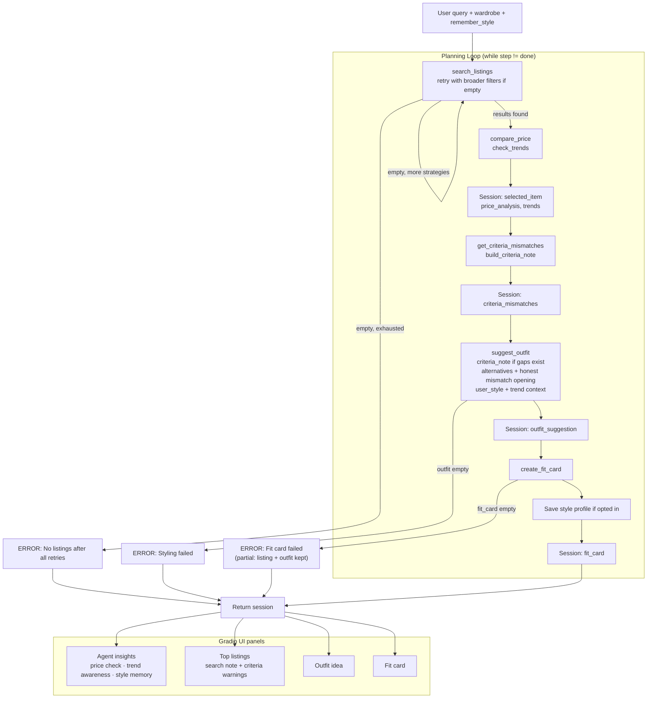

# FitFindr — planning.md

> Complete this document before writing any implementation code.
> Your spec and agent diagram are what you'll use to direct AI tools (Claude, Copilot, etc.) to generate your implementation — the more specific they are, the more useful the generated code will be.
> Your planning.md will be reviewed as part of your submission.
> Update it before starting any stretch features.

---

## Tools

List every tool your agent will use. For each tool, fill in all four fields.
You must have at least 3 tools. The three required tools are listed — add any additional tools below them.

### Tool 1: search_listings

**What it does:**
Searches the mock listings dataset for secondhand items that match the user's description. Applies optional size and price filters, scores results by keyword relevance, and returns the best matches first.

**Input parameters:**
- `description` (str): Keywords describing what the user wants (e.g. `"vintage graphic tee"`). Matched against each listing's `title`, `description`, and `style_tags`.
- `size` (str | None): Size to filter by (e.g. `"M"`). Case-insensitive partial match (e.g. `"M"` matches `"S/M"`). Pass `None` to skip size filtering.
- `max_price` (float | None): Maximum price in dollars, inclusive (e.g. `30.0`). Pass `None` to skip price filtering.

**What it returns:**
A list of listing dicts sorted by relevance (best match first). Each dict has:
- `id` (str): unique listing ID (e.g. `"lst_033"`)
- `title` (str): item name
- `description` (str): seller description
- `category` (str): one of `tops`, `bottoms`, `outerwear`, `shoes`, `accessories`
- `style_tags` (list[str]): style descriptors (e.g. `["vintage", "grunge", "band tee"]`)
- `size` (str): size label as listed (e.g. `"M"`, `"S/M"`, `"W30 L30"`)
- `condition` (str): one of `excellent`, `good`, `fair`
- `price` (float): price in dollars
- `colors` (list[str]): color names
- `brand` (str | None): brand name, or `null` if unknown
- `platform` (str): one of `depop`, `thredUp`, `poshmark`

Returns an empty list `[]` if nothing matches. Does not raise an exception.

**What happens if it fails or returns nothing:**
Returns `[]` without raising. The planning loop **retries with broader filters** before treating this as a failure. Only after all strategies are exhausted does the agent set `session["error"]` and return early without calling downstream tools.

---

### Tool 2: suggest_outfit

**What it does:**
Takes a listing the user might buy and their existing wardrobe, then uses the LLM to suggest 1–2 complete outfits. Names specific wardrobe pieces when available; falls back to general styling advice when the wardrobe is empty. When the top pick does not fully match the user's request, opens with an honest mismatch explanation and compares top-K alternatives.

**Input parameters:**
- `new_item` (dict): A single listing dict from `search_listings` (same fields as above). The item the user is considering buying.
- `wardrobe` (dict): The user's closet, loaded via `get_example_wardrobe()` or `get_empty_wardrobe()`. Shape:
  - `items` (list[dict]): each wardrobe item has:
    - `id` (str): unique ID (e.g. `"w_001"`)
    - `name` (str): short description (e.g. `"Baggy straight-leg jeans, dark wash"`)
    - `category` (str): one of `tops`, `bottoms`, `outerwear`, `shoes`, `accessories`
    - `colors` (list[str]): color names
    - `style_tags` (list[str]): style descriptors
    - `notes` (str | None): optional fit or styling notes
- `alternatives` (list[dict] | None): Other top-K search results when the top pick is not an exact match or criteria are not fully met.
- `user_style` (str | None): Style hints from the query or saved profile (`"I mostly wear…"`).
- `trend_context` (str | None): Summary from `check_trends()` for the user's size bucket.
- `criteria_note` (str | None): Prompt section from `build_criteria_note()` when size, price, keyword, or broadened-search gaps exist.

**What it returns:**
A non-empty string with 1–2 outfit suggestions written in plain language. When the wardrobe has items, references specific pieces by name. When `wardrobe["items"]` is empty, uses general advice or `user_style` from the query / saved profile.

**What happens if it fails or returns nothing:**
Empty wardrobe is not a hard failure. Criteria mismatch is not a hard failure — the tool must admit gaps and still suggest outfits. If the tool returns an empty or whitespace-only string (LLM failure), the agent sets `session["error"]` and returns early without calling `create_fit_card`.

---

### Tool 3: create_fit_card

**What it does:**
Turns the outfit suggestion and listing details into a short, casual social media caption (Instagram/TikTok style). Uses the LLM to write something that feels like a real OOTD post, not a product listing.

**Input parameters:**
- `outfit` (str): The outfit suggestion string returned by `suggest_outfit()`.
- `new_item` (dict): The same listing dict passed into `suggest_outfit` (needs at least `title`, `price`, and `platform` for the caption).

**What it returns:**
A 2–4 sentence string usable as a post caption. Mentions the item name, price, and platform naturally once each, and captures the outfit vibe in casual language (e.g. *"thrifted this faded band tee off depop for $19 and honestly it was made for my wide-legs 🖤 full look in my stories"*).

**What happens if it fails or returns nothing:**
If `outfit` is empty or whitespace-only, the tool returns a descriptive error message string instead of raising an exception. If the LLM returns empty output after a valid outfit, the agent sets `session["error"]` but keeps listing and outfit panels populated (**partial success**).

---

### Additional Tools (if any)

### Tool 4: compare_price *(extra credit)*

**What it does:**
Given a listing the user is considering, finds comparable items in the same dataset (same category, overlapping style tags or title keywords) and estimates whether the listed price is fair relative to the median comparable price, adjusted for condition.

**Input parameters:**
- `item` (dict): A listing dict (typically `session["selected_item"]` after search).

**What it returns:**
A dict with:
- `verdict` (str): one of `"fair"`, `"below_market"`, `"above_market"`, `"insufficient_data"`
- `item_price` (float): the item's listed price
- `median_price` (float | None): median normalized comparable price
- `comparable_count` (int): number of comps used
- `summary` (str): one-line explanation for the UI

**What happens if it fails or returns nothing:**
If fewer than 2 comparables exist, returns `verdict="insufficient_data"` with an explanatory summary — does not raise. The agent still continues to `suggest_outfit`.

---

### Tool 5: check_trends *(extra credit)*

**What it does:**
Surfaces currently popular style tags from a mock public fashion feed (`data/trending_tags.json`), optionally filtered to the user's size range. Simulates checking Depop-style trending posts without a live API.

**Input parameters:**
- `size` (str | None): User's size from parsed query. Maps to a size bucket (e.g. `"M"` → `"M"` trends). `None` uses default trends.

**What it returns:**
A dict with:
- `trending_tags` (list[str]): popular tags for the size bucket
- `size_bucket` (str): which bucket was used
- `platform` (str): mock feed source (e.g. `"depop (mock feed)"`)
- `updated` (str | None): feed date from `data/trending_tags.json`
- `summary` (str): one-line text for prompts

**What happens if it fails or returns nothing:**
If the trends file is missing or empty, returns an empty tag list and a summary saying trends are unavailable — does not raise. Agent continues; UI shows the unavailable message in the Agent insights panel.

---

## Extra Credit Features

### Retry logic with fallback *(implemented)*

When `search_listings` returns no results, the planning loop **does not stop immediately**. It retries with progressively broader strategies via `_search_strategies()`:

1. Original filters (description + size + max_price)
2. Drop size filter
3. Raise budget 50% and drop size
4. Drop size and price filter
5. Broader keywords with relaxed filters

If a fallback succeeds, `session["search_broadened"] = True` and `session["search_note"]` tells the user what was adjusted. If all strategies fail, the error message notes that automatic broadening was already attempted.

### Style profile memory *(extra credit — implemented)*

Persists the user's style preferences in `data/style_profile.json` across Gradio sessions via `utils/style_profile.py`.

- **Load:** At session start, if Remember my style is on and the query has no `"I mostly wear…"` phrase, use saved `style_hints` from the profile.
- **Save:** After a successful run, if Remember my style is on and the query contained new style hints, merge them into the profile.
- **Use:** Passed to `suggest_outfit` as `user_style` (especially when the wardrobe is empty).
- **UI:** Agent insights panel shows load/save status (e.g. *"using saved preferences"*, *"saved for next time"*).

---

## Planning Loop

**How does your agent decide which tool to call next?**

`run_agent(query, wardrobe, remember_style=False)` uses a **while-loop planner** — the next step depends on what the previous tool returned:

```
step = "search"
while step != "done":
    search:  call search_listings; if empty, loop with next broader strategy
             if all strategies fail → error, return
             else → price_check

    price_check: compare_price(selected_item) + check_trends(size) → criteria_check

    criteria_check: get_criteria_mismatches + build_criteria_note
                    (size / price / keyword / broadened search gaps)
                    → suggest

    suggest: call suggest_outfit with criteria_note if gaps exist
             pass top-K alternatives; LLM opens with honest mismatch
             if empty outfit → error, return
             else → fit_card

    fit_card: create_fit_card; on failure return partial results
             else save style profile → done
```

**Branch summary:**

| After step | Condition | Next action |
|------------|-----------|-------------|
| `search_listings` | empty, more strategies | Loop back to search with broader filters |
| `search_listings` | empty, exhausted | Set error, return |
| `search_listings` | results found | `compare_price` + `check_trends` on top pick |
| `compare_price` / `check_trends` | always | `get_criteria_mismatches` → `build_criteria_note` |
| criteria check | gaps found (size, price, keyword, broadened) | `suggest_outfit` with `criteria_note` + top-K alternatives; UI shows ⚠️ in listings panel |
| criteria check | all criteria met | `suggest_outfit` with top pick only |
| `suggest_outfit` | empty string | Set error, return |
| `suggest_outfit` | non-empty | `create_fit_card` |
| `create_fit_card` | failure | Partial success (listing + outfit) |
| `create_fit_card` | success | Save style profile if opted in, return |

**How it knows it's done:** Returns session when `step == "done"` or on any early-exit error path.

---

## State Management

**How does information from one tool get passed to the next?**

Everything for one user interaction lives in a single **session dict** created by `_new_session(query, wardrobe)`. The planning loop reads from and writes to this dict — nothing is passed between tools except through session fields.

| Session field | Set when | Used by |
|---------------|----------|---------|
| `query` | session init | reference only (original user input) |
| `parsed` | after regex parse | `search_listings(description, size, max_price)` |
| `search_results` | after search | top K (`TOP_K=3`); pick `selected_item = results[0]` |
| `search_broadened` / `search_note` | fallback search succeeded | listings panel |
| `selected_item` | top search result | `compare_price`, `suggest_outfit`, `create_fit_card` |
| `price_analysis` | after compare_price | Agent insights panel |
| `trends` | after check_trends | Agent insights panel + `suggest_outfit` prompt |
| `criteria_mismatches` | after criteria check | listings panel + `criteria_note` in `suggest_outfit` |
| `exact_match` | after criteria check | whether to pass alternatives |
| `wardrobe` | session init | `suggest_outfit` |
| `parsed.effective_style` / `style_from_profile` | parse + profile load | `suggest_outfit` as `user_style` |
| `style_profile_saved` | after successful save | Agent insights panel |
| `outfit_suggestion` | after suggest | `create_fit_card` |
| `fit_card` | after fit card | returned to caller on success |
| `plan_log` | each tool call | audit trail of planner decisions |
| `error` | on early exit | returned to caller; check this first |

**UI mapping (`app.py`):** session → Agent insights (price + trends + style memory) · Top listings · Outfit idea · Fit card.

**Data flow:** `parsed` → `search_results` → `selected_item` → `price_analysis` / `trends` / `criteria_mismatches` → `outfit_suggestion` → `fit_card`. Style hints saved to `data/style_profile.json` after success when Remember my style is on.

---

## Error Handling

For each tool, describe the specific failure mode you're handling and what the agent does in response.

| Tool / step | Failure mode | Agent response |
|-------------|-------------|----------------|
| `search_listings` | No results on first attempt | **Not a final failure.** Planning loop retries with broader strategies (drop size → raise budget → drop price cap → shorter keywords). |
| `search_listings` | No results after all retry strategies | Sets `session["error"]` with what was searched, concrete tips, and a note that filters were already relaxed automatically. Returns early — does **not** call `compare_price`, `suggest_outfit`, or `create_fit_card`. User sees error only in the listings panel. |
| `search_listings` | Results found only after broadened search | **Not an error.** Sets `session["search_broadened"] = True` and `session["search_note"]` (e.g. *"Broadened search: dropped size filter, no price cap."*). Continues to price check and styling. |
| `compare_price` | Fewer than 2 comparable listings (`insufficient_data`) | **Not an error.** Tool returns a summary like *"Not enough similar listings to judge whether this price is fair."* Agent continues to `check_trends` and `suggest_outfit`. |
| `check_trends` | Trends file missing or empty | **Not an error.** Tool returns empty tags and *"Trend data is unavailable right now."* Agent continues without trend context in the prompt. |
| Criteria check | Top pick fails original size, price, keyword, or broadened-search expectations | **Not a hard failure.** Sets `session["criteria_mismatches"]` and passes `criteria_note` into `suggest_outfit`. Listings panel shows ⚠️ bullets; outfit panel must open by admitting nothing fully meets the request, then still offer 1–2 styling ideas from the closest available listing(s). |
| `suggest_outfit` | Empty wardrobe (`wardrobe["items"]` is empty) | **Not an error.** Tool uses general styling advice, or `user_style` from the query / saved profile when available. Agent continues to `create_fit_card`. |
| `suggest_outfit` | LLM returns empty or whitespace-only string | Sets `session["error"] = "Couldn't generate a styling suggestion. Try again."` Returns early — does **not** call `create_fit_card`. User keeps listings (and price/trend/criteria info) but outfit and fit card panels are empty. |
| `create_fit_card` | Empty or whitespace `outfit` input | Tool returns descriptive error string (no exception, no Groq call). Agent treats this as failure if reached from an empty outfit path. |
| `create_fit_card` | LLM returns empty output or error string after valid outfit | Sets `session["error"]` with listing title, price, and platform. **Partial success:** listings panel and outfit panel still show results; fit card panel is empty with ⚠️ appended to listings. |

**Principles:** Tools never crash the agent — they return empty results, error strings, or `insufficient_data` verdicts. The planning loop decides whether to retry, warn, or stop. The user always gets an explanation, not a silent failure.

**Example — no results after retries:**

Query: *"designer ballgown size XXS under $5"*

```
No listings matched 'designer ballgown' in size xxs under $5. Try broadening your search, raising your budget above $5, removing the size filter. The agent already tried relaxing your filters automatically.
```

**Example — criteria mismatch (soft warning, not a stop):**

Query: *"vintage tee size XXS under $5"* (broadened search returns Y2K Baby Tee, S/M, $18)

Listings panel shows ⚠️ bullets for size, price, and broadened search. Outfit panel opens with what's wrong, then still suggests outfits for the closest pick.

**Example — fit card partial failure:**

Listings and outfit panels populated; listings panel ends with:

```
⚠️ Found Y2K Baby Tee — Butterfly Print ($18 on depop) but couldn't generate a fit card caption. Try your search again...
```

---

## Architecture



---

## AI Tool Plan

**Milestone 2 — Planning doc**

**AI tool:** Cursor (Claude)

I used Cursor to draft the full **Tools**, **Planning Loop**, **State Management**, **Error Handling**, and **Architecture** sections of this file before writing implementation code.

For the **Architecture** diagram, I described the while-loop planner (search retry → `compare_price` → `check_trends` → criteria check → `suggest_outfit` → `create_fit_card` → style profile save) and the four Gradio UI panels. I asked Claude to convert that into a Mermaid flowchart. Before using it, I pasted the block into [mermaid.live](https://mermaid.live) to confirm it renders and checked that error branches and the UI subgraph match the code in `agent.py` and `app.py`.

---

**Milestone 3 — Core tool implementations**

**AI tool:** Cursor (Claude)

For **`search_listings`**, I gave Claude the **Tool 1** block, the stub in `tools.py`, and `utils/data_loader.py`. I verified filtering by `description`, `size`, and `max_price`, keyword scoring with phrase boosts for `"graphic tee"`, and `[]` returned without raising. Tested with happy path, no-results, and unfiltered queries.

For **`suggest_outfit`**, I gave Claude **Tool 2**, `data/wardrobe_schema.json`, and Groq setup instructions. Iterated to add `alternatives`, `user_style`, `trend_context`, and `criteria_note` for top-K comparison, saved style hints, trend context, and honest mismatch openings. Tested with example and empty wardrobes (mocking `_call_groq` in tests).

For **`create_fit_card`**, I gave Claude **Tool 3** and verified the empty-outfit guard, temperature `0.9` for varied captions, and error-string return instead of exceptions.

For **`tests/test_tools.py`**, I asked for one test per failure mode plus happy paths. Verified with `python -m pytest tests/test_tools.py -v` (14 tests).

---

**Milestone 4 — Extra credit tools**

**AI tool:** Cursor (Claude)

For **`compare_price`**, I specified Tool 4 in this file and asked Claude to find comparables by category + tag/title overlap, normalize by condition, and return `fair` / `below_market` / `above_market` / `insufficient_data` without raising. Tested with real listings and a unique-item insufficient-data case.

For **`check_trends`**, I created `data/trending_tags.json` and specified Tool 5. Claude implemented size-bucket mapping and mock feed loading. Tested size `"M"` vs default bucket.

For **style profile memory**, I specified persistence in `data/style_profile.json` via `utils/style_profile.py` — load on start, save after success, merge hints without duplication. Tested with `tests/test_style_profile.py`.

For **retry with fallback**, I specified `_search_strategies()` in `agent.py` and verified broadened-search notes appear when strict filters return nothing.

For **criteria mismatch**, I added `get_criteria_mismatches()`, `build_criteria_note()`, and prompt updates so the outfit panel admits when size/price/keyword/broadened-search gaps exist. Tested with `vintage tee size XXS under $5`.

---

**Milestone 5 — Planning loop, UI, and tests**

**AI tool:** Cursor (Claude)

For **`run_agent()`**, I gave Claude the updated **Planning Loop**, **State Management**, **Error Handling**, and **Architecture** sections. The result is a `while step != "done"` loop — not a blind fixed sequence — that retries search, runs extra-credit tools, branches on criteria gaps, returns partial success on fit-card failure, and saves style profile when opted in.

For **`app.py`**, I wired four output panels: **Agent insights** (price check, trend awareness tags, style memory status), **Top listings** (top 3, broadened-search note, criteria warnings), **Outfit idea**, and **Fit card**. Fixed layout issues (wardrobe column stacking, equal-height result panels).

For **tests**, I expanded coverage to `tests/test_agent.py` (18 tests), `tests/test_tools.py` (14 tests), and `tests/test_style_profile.py` (2 tests). Full suite: `python -m pytest tests/ -v` — **34 tests passed**.

Before submission, I re-read this file against the code and updated the **Complete Interaction** walkthrough, Mermaid diagram, and this AI Tool Plan to match what actually shipped.

---

## A Complete Interaction (Step by Step)

FitFindr helps users find thrift pieces and style them with what they already own — or general advice when the wardrobe is empty. One query runs the full planner; the agent picks the next tool based on what came back.

**Example user query:** `"I'm looking for a vintage graphic tee under $30. I mostly wear baggy jeans and chunky sneakers. What's out there and how would I style it?"`

**Settings:** Example wardrobe · Remember my style **on**

**Step 1 — Parse:** Regex extracts `description="vintage graphic tee"`, `max_price=30.0`, `style_hints="baggy jeans and chunky sneakers"`.

**Step 2 — Search:** `search_listings("vintage graphic tee", size=None, max_price=30.0)`. Returns matches; agent keeps top 3 (`TOP_K=3`). Top pick stored as `selected_item`.

**Step 3 — Price check:** `compare_price(selected_item)` → verdict + summary shown in Agent insights panel.

**Step 4 — Trends:** `check_trends(size=None)` → size `default` bucket tags from mock Depop feed, shown in Agent insights and passed to `suggest_outfit`.

**Step 5 — Criteria check:** If top pick fails size/price/keyword expectations (or search was broadened), set `criteria_mismatches` and `criteria_note`.

**Step 6 — Outfit:** `suggest_outfit(new_item, wardrobe, alternatives=..., user_style=..., trend_context=..., criteria_note=...)`. Names wardrobe pieces or saved style hints. Returns outfit string.

**Step 7 — Fit card:** `create_fit_card(outfit, new_item)` → casual caption.

**Step 8 — Save profile:** If Remember my style is on, merge `style_hints` into `data/style_profile.json`.

**Final UI output:**
- **Agent insights:** price check + trend awareness tags + style memory status
- **Top listings:** #1–#3 with top pick marked
- **Outfit idea:** styling suggestion
- **Fit card:** shareable caption

**Alternate path — criteria mismatch:** Query `"vintage tee size XXS under $5"` broadens search, shows ⚠️ warnings, outfit panel opens admitting nothing fully matches, then still suggests styling for the closest pick.
